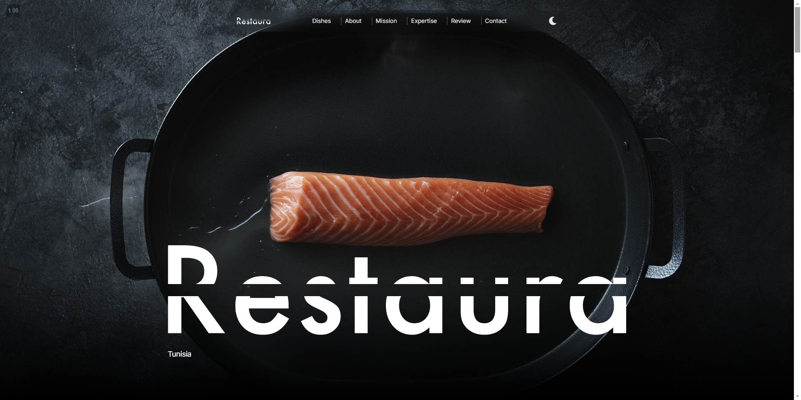
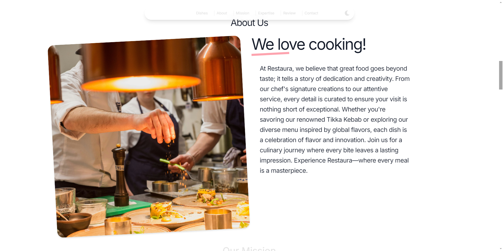
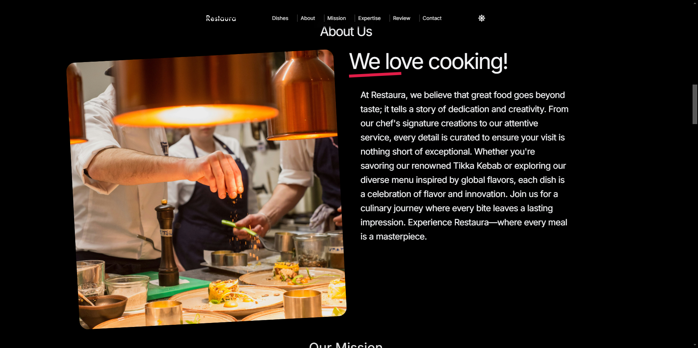
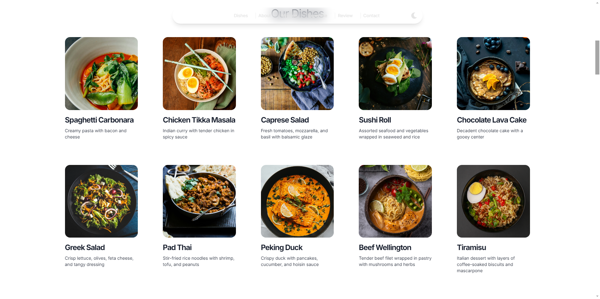
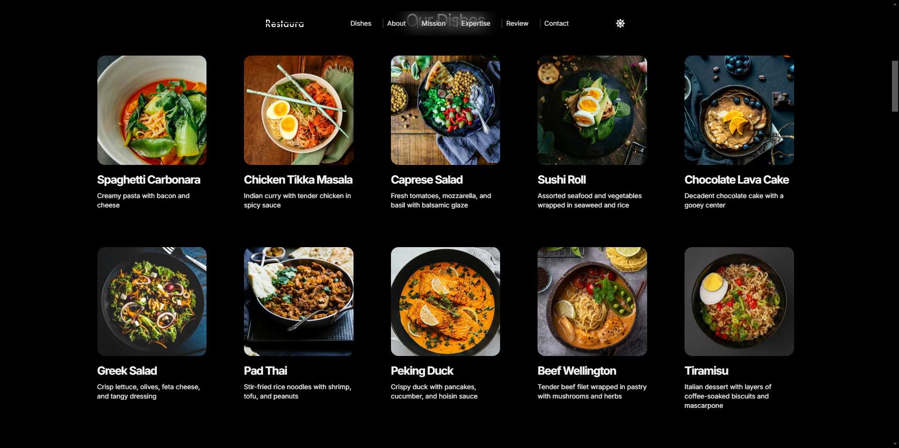
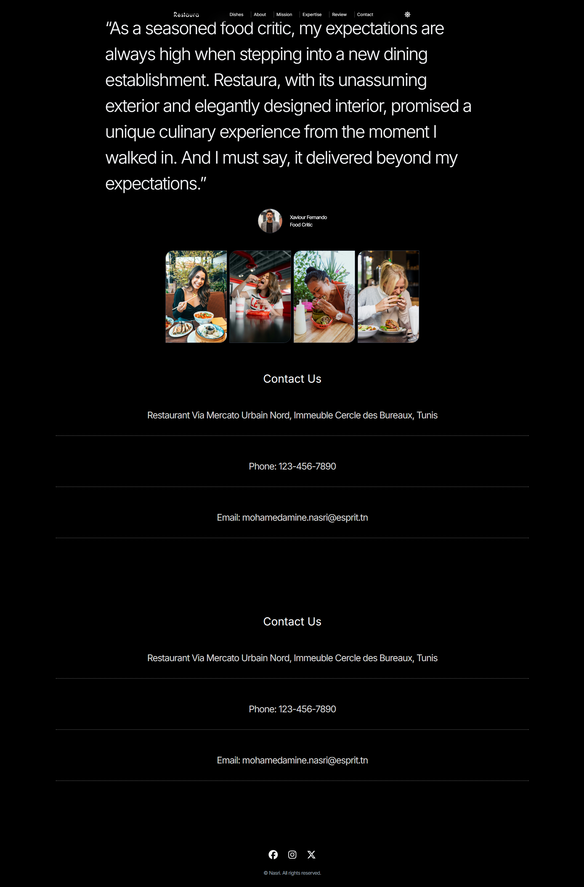

# Restaura

Welcome to **Restaura**, a modern landing page crafted to showcase a restaurant's unique offerings, mission, and expertise. Explore our website to learn more about our dishes, read about our mission, and get in touch with us.

## Live Demo

Experience Restaura in action: [View Live Site](https://restaura-rho.vercel.app/)

## Technologies Used

- **React**: For building interactive user interface components and managing application state.
- **Tailwind CSS**: For utility-first CSS styling and responsive design.
- **Framer Motion**: For adding smooth animations and transitions to enhance user experience.
- **Context API**: For managing theme state across the application.

## Features

### Hero Section
A captivating introduction with a background video and dynamic theme switcher.


### About Us
Learn about the restaurant with a responsive layout that adapts to light and dark themes.



### Our Dishes
Explore a variety of dishes presented through visually appealing cards.



### Our Expertise
Highlighting our expertise in various cuisines with styled sections.

### Mission
Discover our mission with a video background and overlay text.


### Contact Us
Get in touch with us through our theme-adaptive contact section.

### Review Section
Read customer reviews, featuring images and text styled based on the current theme.


### Footer
Includes social media links and copyright information.

## Screenshots

Here are some screenshots of the website:

- **Hero Section**
  

- **Dishes Section (Light Mode)**
  

- **Dishes Section (Dark Mode)**
  

- **About Us (Light Mode)**
  

- **About Us (Dark Mode)**
  

- **Mission**
  

- **Review Section and Footer**
  

## Getting Started

To get a local copy up and running, follow these steps:

1. **Clone the repository**
   ```bash
   git clone https://github.com/MohamedAmineNasri/Restaura.git

# Navigate to the project directory (assuming the repository is cloned in your current directory)
cd restaura

# Install the dependencies
npm install

# Run the development server
npm run dev